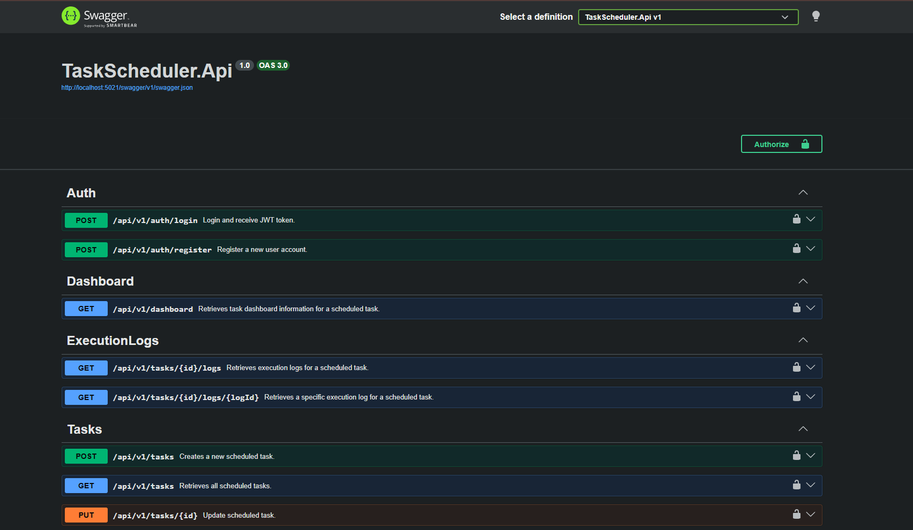
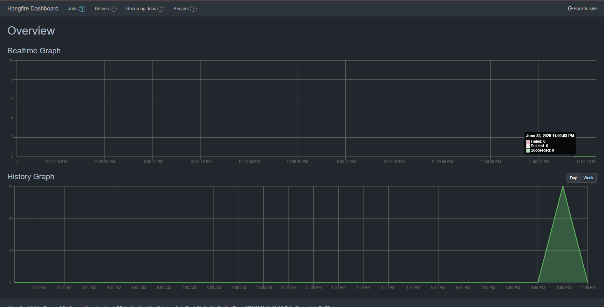
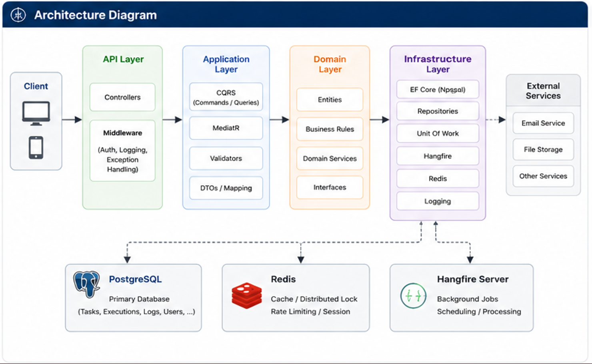
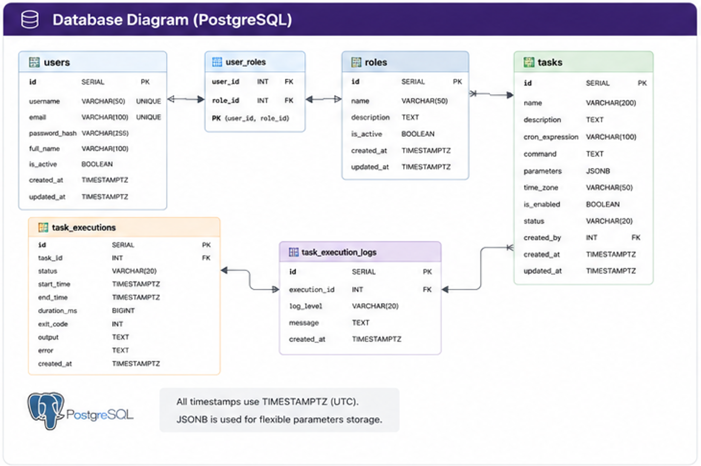

# Enterprise Task Scheduler System

A scalable and maintainable backend platform for scheduling, executing, and monitoring background tasks. The system is designed based on Clean Architecture principles to ensure high maintainability, extensibility, and testability.

---

## 🚀 Overview

The Task Scheduler System allows users to create, manage, schedule, and monitor background jobs. It supports task execution history, logging, authentication, and asynchronous processing.

The project aims to simulate a real-world enterprise scheduling platform similar to Windows Task Scheduler.

---

## ✨ Features

### Authentication & Authorization

- JWT Authentication
- Role-based Authorization
- Secure API access

### Task Management

- Create scheduled tasks
- Update task information
- Enable/Disable tasks
- Delete tasks
- View task details

### Task Scheduling

- Execute tasks immediately
- Schedule recurring tasks
- Manage task lifecycle
- Background job processing

### Execution Monitoring

- Track execution history
- Store execution logs
- Monitor execution status
- Capture execution duration
- Retry failed tasks

### Logging & Auditing

- Record execution results
- Store error information
- Audit task activities

---

## 🏗️ Architecture

The project follows **Clean Architecture** principles.

```text
┌───────────────────┐
│      API Layer    │
└─────────┬─────────┘
          │
┌─────────▼─────────┐
│ Application Layer │
│   CQRS + MediatR  │
└─────────┬─────────┘
          │
┌─────────▼─────────┐
│   Domain Layer    │
│ Business Rules    │
└─────────┬─────────┘
          │
┌─────────▼─────────┐
│Infrastructure Layer│
│ EF Core, Redis,   │
│ Hangfire, Logging │
└─────────┬─────────┘
          │
┌─────────▼─────────┐
│    PostgreSQL     │
└───────────────────┘
```

---

## 🛠️ Technology Stack

### Backend

- ASP.NET Core
- C#
- Entity Framework Core
- RESTful APIs

### Architecture

- Clean Architecture
- CQRS
- MediatR
- Repository Pattern
- Unit of Work
- Dependency Injection

### Database

- PostgreSQL

### Background Processing

- Hangfire

### Caching

- Redis

### Security

- JWT Authentication
- Role-based Authorization

### DevOps & Tools

- Docker
- Swagger/OpenAPI
- Git

### Testing

- xUnit
- FluentAssertions
- Moq
- Bogus
- Testcontainers
---

## 📂 Project Structure

```text
src/
├── TaskScheduler.API
├── TaskScheduler.Application
├── TaskScheduler.Domain
└── TaskScheduler.Infrastructure

tests/
├── TaskScheduler.Domain.Tests
├── TaskScheduler.Application.Tests
├── TaskScheduler.Infrastructure.Tests
└── TaskScheduler.API.Tests
```

## 🏗️ Layer Responsibilities

| Layer | Responsibility |
|--------|---------------|
| API | Expose REST APIs and handle HTTP requests |
| Application | Use cases, CQRS handlers, DTOs, validations |
| Domain | Business rules, entities, domain services |
| Infrastructure | Database access, Redis, Hangfire, external integrations |

## 🧪 Testing Strategy

The project includes automated tests to ensure business logic correctness, reliability, and maintainability.

### Test Coverage

- Unit tests for Domain entities and business rules.
- Unit tests for CQRS Command and Query Handlers.
- Validation tests for commands and requests.
- Repository and Infrastructure tests.
- API endpoint tests.
- Background job execution tests.

### Run Tests

```bash
dotnet test
```

---

## 🔄 Main Workflow

### Create Task

```text
Client
   │
   ▼
API Controller
   │
   ▼
MediatR Command
   │
   ▼
Application Handler
   │
   ▼
Domain Validation
   │
   ▼
Repository
   │
   ▼
PostgreSQL
```

---

### Execute Scheduled Task

```text
Hangfire
   │
   ▼
TaskJob
   │
   ▼
TaskExecutionService
   │
   ▼
Execute Business Logic
   │
   ▼
Save Execution Log
   │
   ▼
Update Task Status
```

---

## 🔐 Security

- JWT-based Authentication
- Role-based Authorization
- Protected API endpoints

---

## 📊 Logging & Monitoring

The system stores execution information including:

- Execution Status
- Start Time
- End Time
- Duration
- Error Message
- Standard Output
- Standard Error
- Exit Code

---

## 📌 Key Design Patterns

- Clean Architecture
- CQRS Pattern
- Repository Pattern
- Unit of Work Pattern
- Dependency Injection
- Mediator Pattern

---

## 🚀 Future Improvements

- [ ] Kafka Integration
- [ ] Outbox Pattern
- [ ] Distributed Locking
- [ ] Email Notification
- [ ] SignalR Real-time Monitoring
- [ ] Microservices Architecture
- [ ] Retry & Dead Letter Queue
- [ ] Prometheus & Grafana Monitoring

---

## 🧪 Running the Project

### Clone repository

```bash
git clone https://github.com/huuquandev/task-scheduler-system.git
```

### Navigate to project

```bash
cd task-scheduler-system
```

### Run application

```bash
dotnet restore
dotnet build
dotnet run
```

### Run with Docker

```bash
docker-compose up -d
```

---

## 📷 Screenshots

### Swagger UI



### Hangfire Dashboard



### Architecture Diagram



### DataBase Diagram



---

## 👨‍💻 Author

**Huu Quan**

Backend .NET Developer

- GitHub: https://github.com/huuquandev
- LinkedIn: https://www.linkedin.com/in/ph%E1%BA%A1m-h%E1%BB%AFu-qu%C3%A2n-291191419/

---

## ⭐ If you find this project useful, please give it a star.
